# DChat Architecture Documentation

> **Audience**: Internal team  
> **Last Updated**: January 2026  
> **Protocol Version**: 0.1.0

## Table of Contents

1. [System Overview](#system-overview)
2. [Crate Dependency Graph](#crate-dependency-graph)
3. [Core Architecture Layers](#core-architecture-layers)
4. [Cryptography Stack](#cryptography-stack)
5. [Consensus Mechanism](#consensus-mechanism)
6. [Network Layer](#network-layer)
7. [Storage Architecture](#storage-architecture)
8. [Blockchain Infrastructure](#blockchain-infrastructure)
9. [Privacy & Metadata Resistance](#privacy--metadata-resistance)
10. [Smart Contract Platform](#smart-contract-platform)
11. [Validator Key Management](#validator-key-management)
12. [Deployment Architecture](#deployment-architecture)

---

## System Overview

DChat is a decentralized end-to-end encrypted messaging platform with sovereign identity and blockchain-based message ordering. The system combines:

- **E2E Encryption**: Signal Protocol (X3DH + Double Ratchet) with post-quantum hybrid cryptography
- **Decentralized Identity**: Sovereign DIDs with multi-device support
- **Parallel Blockchain**: Dual-chain architecture (Chat Chain + Currency Chain)
- **Triple-Layer Consensus**: PoRW + PoT + TSC for Byzantine fault tolerance
- **Privacy Layer**: Onion routing, blind tokens, and zero-knowledge proofs

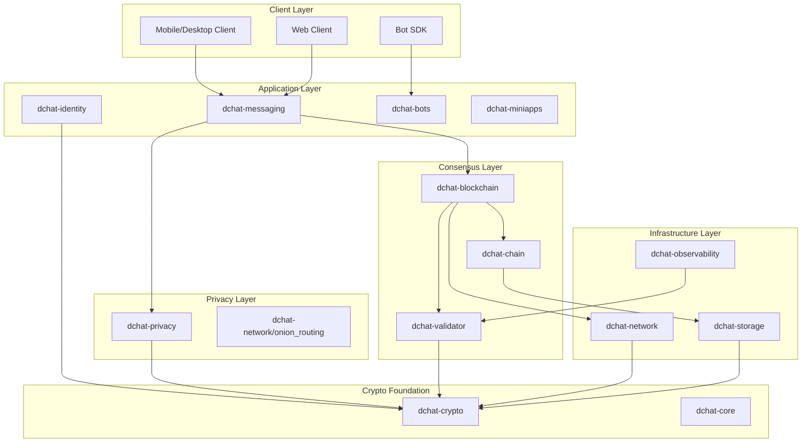
```mermaid
graph TB
    subgraph "Client Layer"
        A[Mobile/Desktop Client]
        B[Web Client]
        C[Bot SDK]
    end

    subgraph "Application Layer"
        D[dchat-messaging]
        E[dchat-identity]
        F[dchat-bots]
        G[dchat-miniapps]
    end

    subgraph "Privacy Layer"
        H[dchat-privacy]
        I[dchat-network/onion_routing]
    end

    subgraph "Consensus Layer"
        J[dchat-blockchain]
        K[dchat-validator]
        L[dchat-chain]
    end

    subgraph "Infrastructure Layer"
        M[dchat-storage]
        N[dchat-network]
        O[dchat-observability]
    end

    subgraph "Crypto Foundation"
        P[dchat-crypto]
        Q[dchat-core]
    end

    A --> D
    B --> D
    C --> F
    D --> H
    D --> J
    E --> P
    H --> P
    J --> K
    J --> L
    J --> N
    K --> P
    L --> M
    N --> P
    M --> P
    O --> K
```

---

## Crate Dependency Graph

The workspace contains 27 crates organized in a layered architecture. All edges shown below:

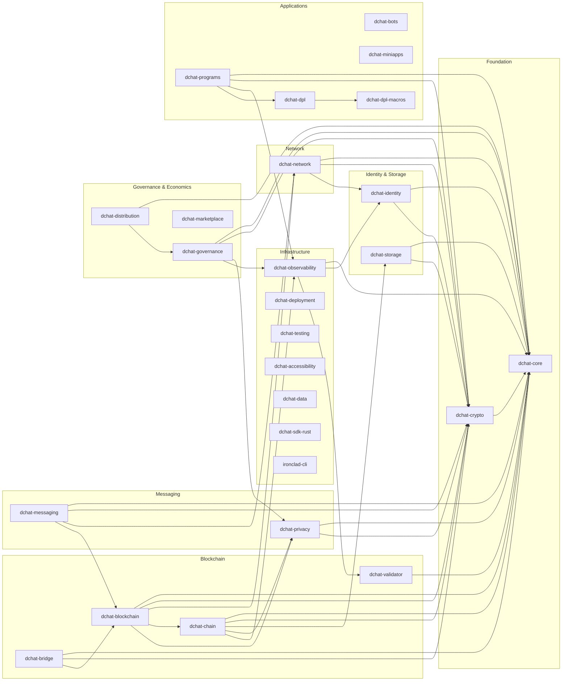
```mermaid
graph LR
    subgraph "Foundation"
        core[dchat-core]
        crypto[dchat-crypto]
    end

    subgraph "Identity & Storage"
        identity[dchat-identity]
        storage[dchat-storage]
    end

    subgraph "Network"
        network[dchat-network]
    end

    subgraph "Messaging"
        messaging[dchat-messaging]
        privacy[dchat-privacy]
    end

    subgraph "Blockchain"
        chain[dchat-chain]
        blockchain[dchat-blockchain]
        validator[dchat-validator]
        bridge[dchat-bridge]
    end

    subgraph "Governance & Economics"
        governance[dchat-governance]
        distribution[dchat-distribution]
        marketplace[dchat-marketplace]
    end

    subgraph "Applications"
        bots[dchat-bots]
        miniapps[dchat-miniapps]
        programs[dchat-programs]
        dpl[dchat-dpl]
        dpl_macros[dchat-dpl-macros]
    end

    subgraph "Infrastructure"
        observability[dchat-observability]
        deployment[dchat-deployment]
        testing[dchat-testing]
        accessibility[dchat-accessibility]
        data[dchat-data]
        sdk[dchat-sdk-rust]
        cli[ironclad-cli]
    end

    %% Foundation edges
    crypto --> core

    %% Identity & Storage edges
    identity --> core
    identity --> crypto
    storage --> core
    storage --> crypto

    %% Network edges
    network --> core
    network --> crypto
    network --> identity

    %% Messaging edges
    messaging --> core
    messaging --> crypto
    messaging --> network
    messaging --> blockchain
    privacy --> core
    privacy --> crypto

    %% Blockchain edges
    chain --> core
    chain --> crypto
    chain --> storage
    chain --> privacy
    chain --> observability
    blockchain --> core
    blockchain --> crypto
    blockchain --> network
    blockchain --> chain
    blockchain --> privacy
    validator --> core
    bridge --> core
    bridge --> crypto
    bridge --> blockchain

    %% Governance edges
    governance --> core
    governance --> crypto
    governance --> privacy
    governance --> observability
    distribution --> core
    distribution --> governance

    %% Application edges
    programs --> core
    programs --> crypto
    programs --> observability
    programs --> dpl
    dpl --> dpl_macros

    %% Infrastructure edges
    observability --> core
    observability --> identity
    observability --> validator
```

### Crate Purposes

| Crate                 | Purpose                                            |
| --------------------- | -------------------------------------------------- |
| `dchat-core`          | Core types, errors, config, monetary units (Motes) |
| `dchat-crypto`        | All cryptographic primitives, key management       |
| `dchat-identity`      | DID, attestation, FROST threshold signatures       |
| `dchat-network`       | libp2p networking, NAT traversal, relay            |
| `dchat-messaging`     | Message protocol, channel management               |
| `dchat-storage`       | Database abstraction, encryption-at-rest           |
| `dchat-chain`         | Transaction types, VRF, BLS aggregation            |
| `dchat-blockchain`    | Parallel chains, consensus, wallets                |
| `dchat-validator`     | Validator node operations, health checks           |
| `dchat-privacy`       | ZK proofs (Groth16), blind tokens, stealth         |
| `dchat-governance`    | On-chain governance, proposals, voting             |
| `dchat-bridge`        | Cross-chain bridge (Solana, external)              |
| `dchat-programs`      | WASM smart contract runtime (wasmi)                |
| `dchat-dpl`           | DChat Program Language SDK                         |
| `dchat-observability` | Metrics, tracing, telemetry                        |

---

## Core Architecture Layers

### Layer Responsibilities

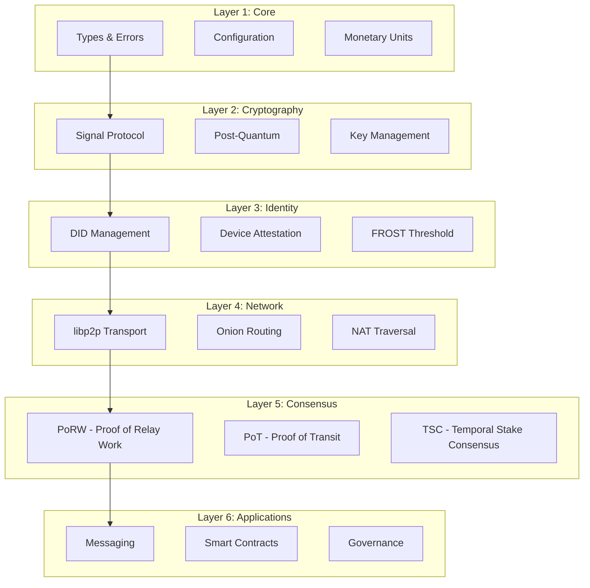
```mermaid
graph TB
    subgraph "Layer 1: Core"
        L1A[Types & Errors]
        L1B[Configuration]
        L1C[Monetary Units]
    end

    subgraph "Layer 2: Cryptography"
        L2A[Signal Protocol]
        L2B[Post-Quantum]
        L2C[Key Management]
    end

    subgraph "Layer 3: Identity"
        L3A[DID Management]
        L3B[Device Attestation]
        L3C[FROST Threshold]
    end

    subgraph "Layer 4: Network"
        L4A[libp2p Transport]
        L4B[Onion Routing]
        L4C[NAT Traversal]
    end

    subgraph "Layer 5: Consensus"
        L5A[PoRW - Proof of Relay Work]
        L5B[PoT - Proof of Transit]
        L5C[TSC - Temporal Stake Consensus]
    end

    subgraph "Layer 6: Applications"
        L6A[Messaging]
        L6B[Smart Contracts]
        L6C[Governance]
    end

    L1A --> L2A
    L2A --> L3A
    L3A --> L4A
    L4A --> L5A
    L5A --> L6A
```

---

## Cryptography Stack

### Algorithm Choices

| Purpose                    | Algorithm         | Version/Params         | Rationale                |
| -------------------------- | ----------------- | ---------------------- | ------------------------ |
| **Key Exchange**           | X25519            | Curve25519             | Signal Protocol standard |
| **Signatures**             | Ed25519           | ed25519-dalek 2.1      | Fast, deterministic      |
| **Symmetric Encryption**   | ChaCha20-Poly1305 | RFC 8439               | Side-channel resistant   |
| **Symmetric (alt)**        | AES-256-GCM       | NIST SP 800-38D        | Hardware acceleration    |
| **Key Derivation**         | HKDF-SHA256       | RFC 5869               | Signal Protocol          |
| **Password Hashing**       | Argon2id          | argon2 0.5             | Memory-hard              |
| **Message Hash**           | BLAKE3            | 1.5                    | Fast, parallelizable     |
| **Block Hash**             | SHA-256           | sha2 0.10              | Bitcoin compatibility    |
| **VRF**                    | Schnorrkel        | 0.11 (Ristretto)       | Committee selection      |
| **BLS Aggregation**        | BLS12-381         | blst 0.3               | Signature aggregation    |
| **Post-Quantum KEM**       | ML-KEM-768        | pqcrypto-mlkem 0.1     | NIST standard (Kyber)    |
| **Post-Quantum Sig**       | Falcon-512        | pqcrypto-falcon 0.3    | Compact signatures       |
| **Post-Quantum Sig (PoT)** | Dilithium3        | pqcrypto-dilithium 0.5 | Consensus signatures     |
| **Threshold Signatures**   | FROST-Ed25519     | frost-ed25519 2.1      | Distributed signing      |

### Signal Protocol Implementation

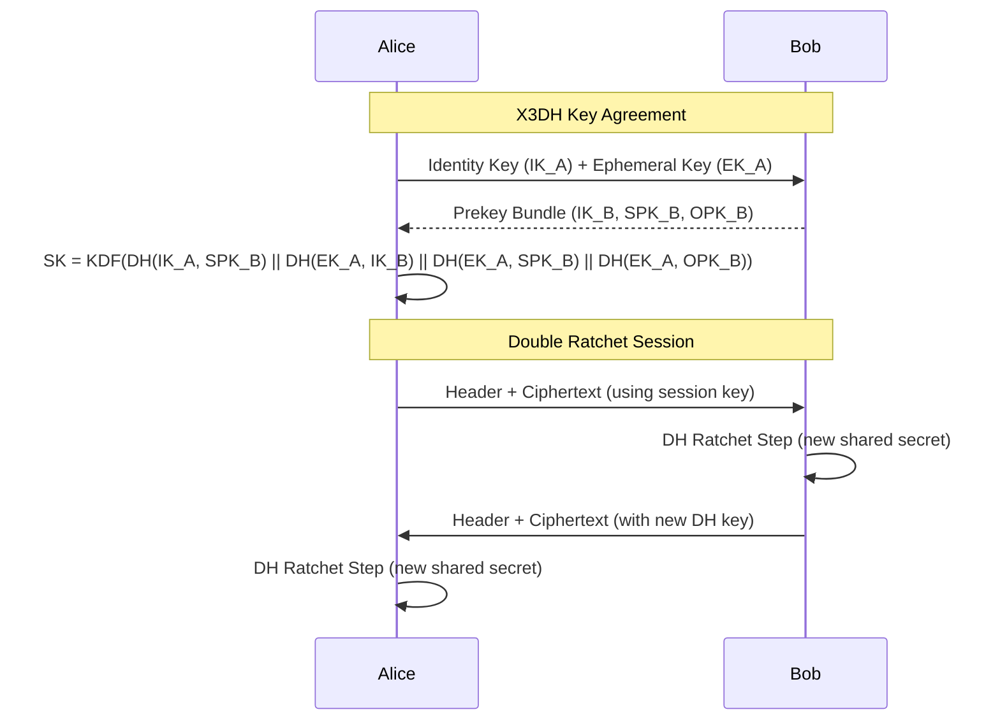
```mermaid
sequenceDiagram
    participant A as Alice
    participant B as Bob

    Note over A,B: X3DH Key Agreement
    A->>B: Identity Key (IK_A) + Ephemeral Key (EK_A)
    B-->>A: Prekey Bundle (IK_B, SPK_B, OPK_B)
    A->>A: SK = KDF(DH(IK_A, SPK_B) || DH(EK_A, IK_B) || DH(EK_A, SPK_B) || DH(EK_A, OPK_B))

    Note over A,B: Double Ratchet Session
    A->>B: Header + Ciphertext (using session key)
    B->>B: DH Ratchet Step (new shared secret)
    B->>A: Header + Ciphertext (with new DH key)
    A->>A: DH Ratchet Step (new shared secret)
```

### Hybrid Post-Quantum KEM

The `HybridKem` combines X25519 and ML-KEM-768 for quantum resistance:

```rust
// Encapsulation combines both algorithms
let (shared_secret, ciphertext) = HybridKem::encapsulate(&recipient_public_key)?;

// Combined via HKDF with domain separation
// IKM = X25519_shared || ML-KEM_shared
// Salt = ephemeral_public || pq_ciphertext
// Info = "dchat-hybrid-kem-v1"
let combined = HKDF-SHA256(ikm, salt, info);
```

### Double Ratchet Session

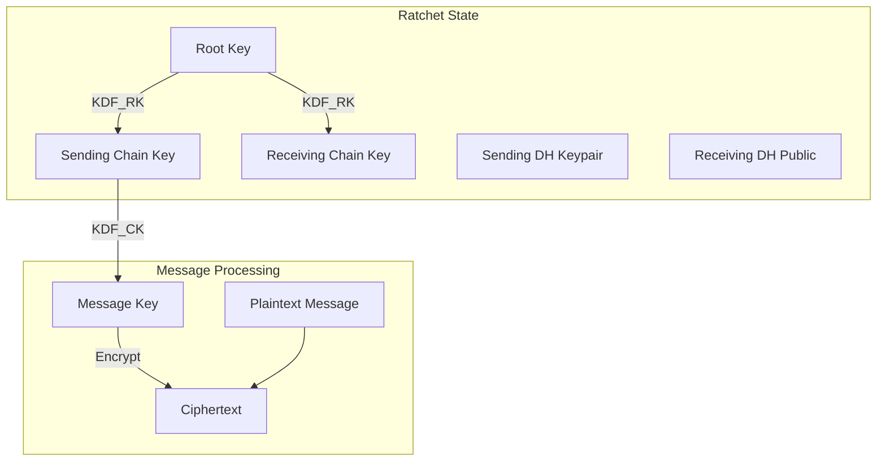
```mermaid
graph TD
    subgraph "Ratchet State"
        RK[Root Key]
        CKs[Sending Chain Key]
        CKr[Receiving Chain Key]
        DHs[Sending DH Keypair]
        DHr[Receiving DH Public]
    end

    subgraph "Message Processing"
        MSG[Plaintext Message]
        MK[Message Key]
        CT[Ciphertext]
    end

    RK -->|KDF_RK| CKs
    RK -->|KDF_RK| CKr
    CKs -->|KDF_CK| MK
    MK -->|Encrypt| CT
    MSG --> CT
```

---

## Consensus Mechanism

### Triple-Layer Consensus Architecture

DChat uses a novel triple-layer consensus for Byzantine fault tolerance:

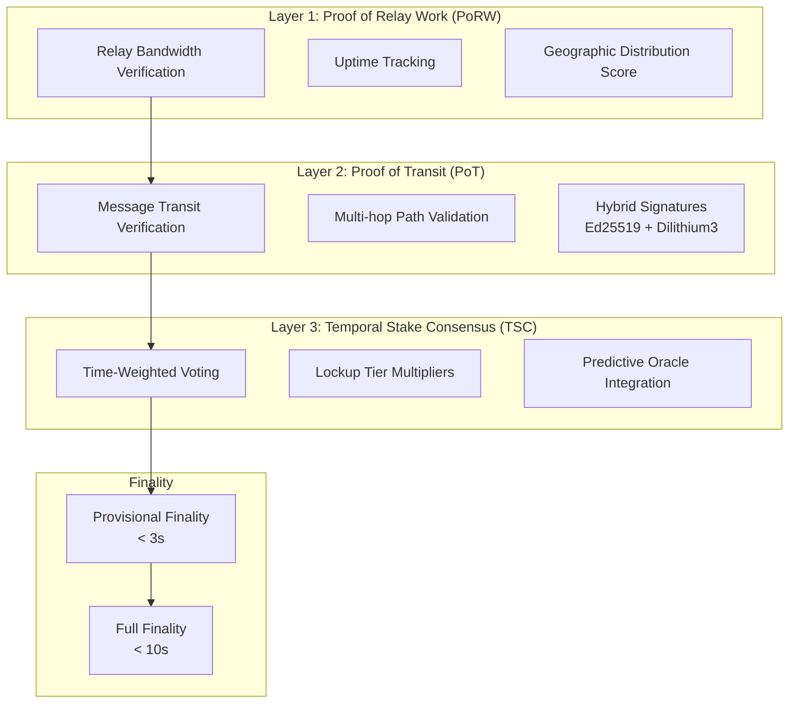
```mermaid
graph TB
    subgraph "Layer 1: Proof of Relay Work (PoRW)"
        PoRW1[Relay Bandwidth Verification]
        PoRW2[Uptime Tracking]
        PoRW3[Geographic Distribution Score]
    end

    subgraph "Layer 2: Proof of Transit (PoT)"
        PoT1[Message Transit Verification]
        PoT2[Multi-hop Path Validation]
        PoT3[Hybrid Signatures<br/>Ed25519 + Dilithium3]
    end

    subgraph "Layer 3: Temporal Stake Consensus (TSC)"
        TSC1[Time-Weighted Voting]
        TSC2[Lockup Tier Multipliers]
        TSC3[Predictive Oracle Integration]
    end

    PoRW1 --> PoT1
    PoT1 --> TSC1

    subgraph "Finality"
        F1[Provisional Finality<br/>< 3s]
        F2[Full Finality<br/>< 10s]
    end

    TSC1 --> F1
    F1 --> F2
```

### Temporal Stake Lockup Tiers

| Tier       | Duration  | Multiplier | Early Withdrawal Penalty |
| ---------- | --------- | ---------- | ------------------------ |
| Fluid      | 0 days    | 1.0x       | 0%                       |
| Monthly    | 30 days   | 1.5x       | 5%                       |
| Quarterly  | 90 days   | 2.25x      | 10%                      |
| Annual     | 365 days  | 4.0x       | 25%                      |
| Multi-Year | 1095 days | 8.0x       | 50%                      |

### Hardened Consensus Infrastructure

Production consensus uses the `hardened-consensus-integration` feature:

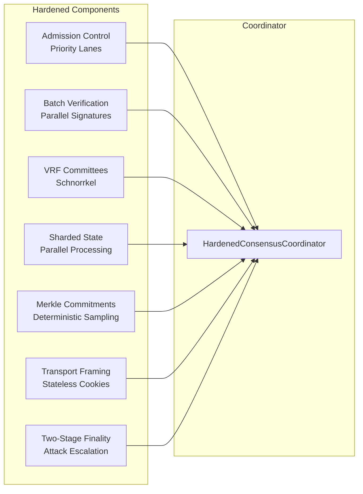
```mermaid
graph LR
    subgraph "Hardened Components"
        AC[Admission Control<br/>Priority Lanes]
        BV[Batch Verification<br/>Parallel Signatures]
        VRF[VRF Committees<br/>Schnorrkel]
        SS[Sharded State<br/>Parallel Processing]
        MC[Merkle Commitments<br/>Deterministic Sampling]
        TF[Transport Framing<br/>Stateless Cookies]
        TSF[Two-Stage Finality<br/>Attack Escalation]
    end

    subgraph "Coordinator"
        HCC[HardenedConsensusCoordinator]
    end

    AC --> HCC
    BV --> HCC
    VRF --> HCC
    SS --> HCC
    MC --> HCC
    TF --> HCC
    TSF --> HCC
```

### VRF Committee Selection

Committees are selected using Schnorrkel VRF with geographic constraints:

```rust
// VRF output determines committee membership
let vrf_output = schnorrkel::vrf_sign(secret_key, epoch_seed);

// Committee membership threshold varies by scope
match committee_scope {
    CommitteeScope::Block => threshold = 0.10,      // 10% of validators
    CommitteeScope::Shard(n) => threshold = 0.05,   // 5% per shard
    CommitteeScope::Geographic(region) => ...       // Regional diversity
}
```

---

## Network Layer

### Transport Stack

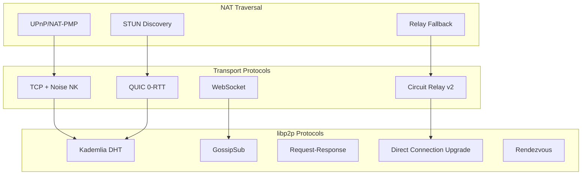
```mermaid
graph TB
    subgraph "Transport Protocols"
        TCP[TCP + Noise NK]
        QUIC[QUIC 0-RTT]
        WS[WebSocket]
        RELAY[Circuit Relay v2]
    end

    subgraph "libp2p Protocols"
        KAD[Kademlia DHT]
        GOSSIP[GossipSub]
        RR[Request-Response]
        DCUTR[Direct Connection Upgrade]
        REND[Rendezvous]
    end

    subgraph "NAT Traversal"
        UPNP[UPnP/NAT-PMP]
        STUN[STUN Discovery]
        TURN[Relay Fallback]
    end

    TCP --> KAD
    QUIC --> KAD
    WS --> GOSSIP
    RELAY --> DCUTR

    UPNP --> TCP
    STUN --> QUIC
    TURN --> RELAY
```

### libp2p Configuration

```toml
[dependencies.libp2p]
version = "0.54"
features = [
  "kad",           # Kademlia DHT
  "noise",         # Noise Protocol encryption
  "tcp",           # TCP transport
  "dns",           # DNS resolution
  "websocket",     # WebSocket transport
  "relay",         # Circuit Relay v2
  "dcutr",         # Direct Connection Upgrade
  "mdns",          # Local peer discovery
  "identify",      # Peer identification
  "ping",          # Keepalive
  "gossipsub",     # Pub/sub messaging
  "yamux",         # Stream multiplexing
  "quic",          # QUIC 0-RTT transport
  "rendezvous",    # Faster channel discovery
  "request-response"  # Onion routing cells
]
```

### Onion Routing Architecture

3-5 hop circuits with Sphinx packet format:

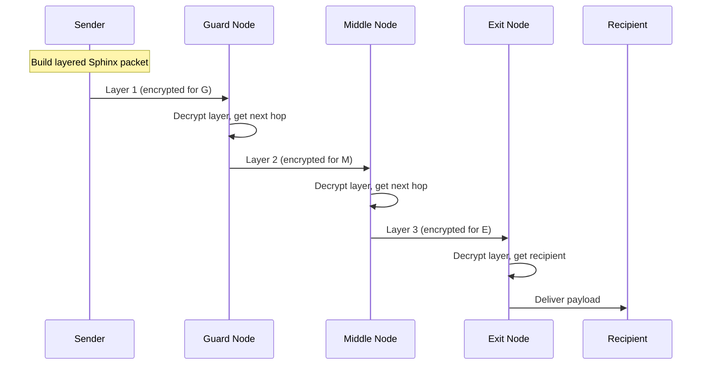
```mermaid
sequenceDiagram
    participant S as Sender
    participant G as Guard Node
    participant M as Middle Node
    participant E as Exit Node
    participant R as Recipient

    Note over S: Build layered Sphinx packet
    S->>G: Layer 1 (encrypted for G)
    G->>G: Decrypt layer, get next hop
    G->>M: Layer 2 (encrypted for M)
    M->>M: Decrypt layer, get next hop
    M->>E: Layer 3 (encrypted for E)
    E->>E: Decrypt layer, get recipient
    E->>R: Deliver payload
```

Path Selection Constraints:

- No two nodes in same ASN
- Geographic diversity (at least 2 regions)
- Relay reputation score > 0.8
- Fresh circuits every 10 minutes

---

## Storage Architecture

### Storage Backends

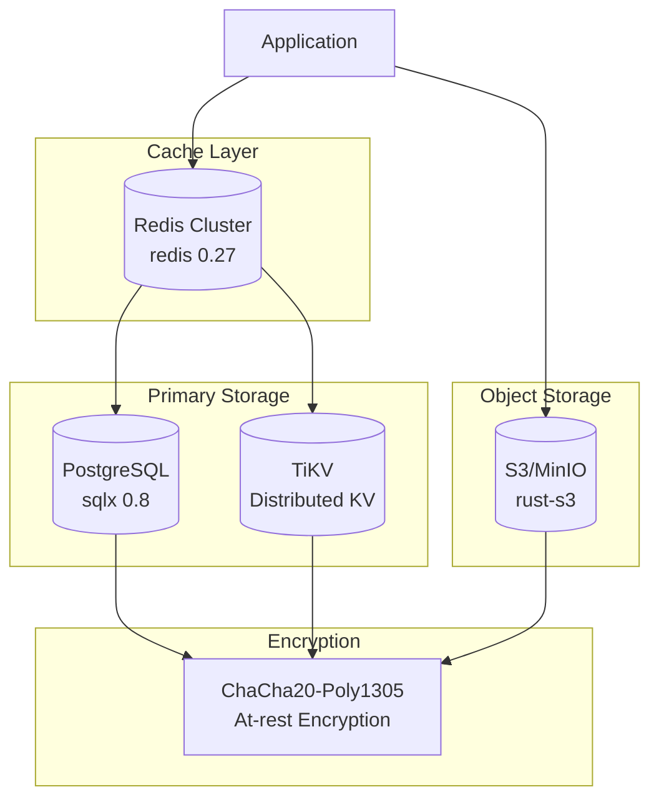
```mermaid
graph TB
    subgraph "Primary Storage"
        PG[(PostgreSQL<br/>sqlx 0.8)]
        TIKV[(TiKV<br/>Distributed KV)]
    end

    subgraph "Cache Layer"
        REDIS[(Redis Cluster<br/>redis 0.27)]
    end

    subgraph "Object Storage"
        S3[(S3/MinIO<br/>rust-s3)]
    end

    subgraph "Encryption"
        ENC[ChaCha20-Poly1305<br/>At-rest Encryption]
    end

    APP[Application] --> REDIS
    REDIS --> PG
    REDIS --> TIKV
    APP --> S3
    PG --> ENC
    TIKV --> ENC
    S3 --> ENC
```

### Compression Pipeline

| Algorithm | Use Case            | Ratio |
| --------- | ------------------- | ----- |
| Zstd      | General messages    | ~3:1  |
| Brotli    | Text content        | ~4:1  |
| LZ4       | Real-time streaming | ~2:1  |

### Content-Addressable Storage

Media files use CID (Content Identifier) with Base32 encoding:

```rust
// CID = Version || Codec || Multihash
// Multihash = HashType || HashLength || Hash
let cid = generate_cid(content);  // BLAKE3 hash
let url = format!("dchat://{}", base32_encode(cid));
```

---

## Blockchain Infrastructure

### Dual-Chain Architecture

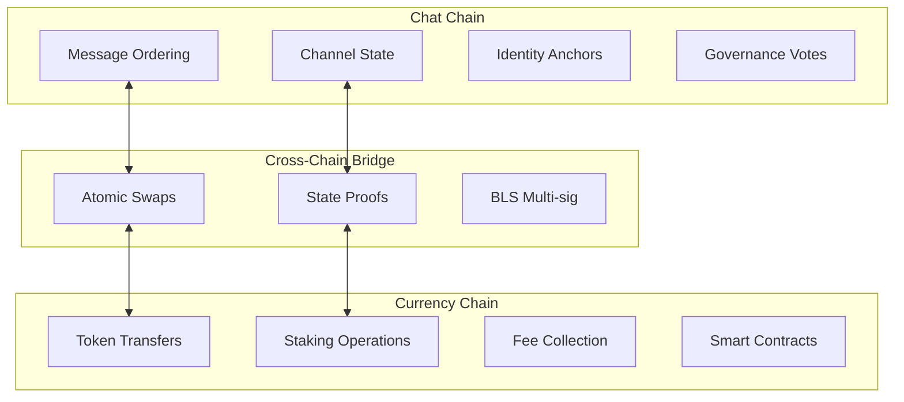
```mermaid
graph TB
    subgraph "Chat Chain"
        CC1[Message Ordering]
        CC2[Channel State]
        CC3[Identity Anchors]
        CC4[Governance Votes]
    end

    subgraph "Currency Chain"
        CU1[Token Transfers]
        CU2[Staking Operations]
        CU3[Fee Collection]
        CU4[Smart Contracts]
    end

    subgraph "Cross-Chain Bridge"
        BR1[Atomic Swaps]
        BR2[State Proofs]
        BR3[BLS Multi-sig]
    end

    CC1 <--> BR1 <--> CU1
    CC2 <--> BR2 <--> CU2
```

### Block Hierarchy

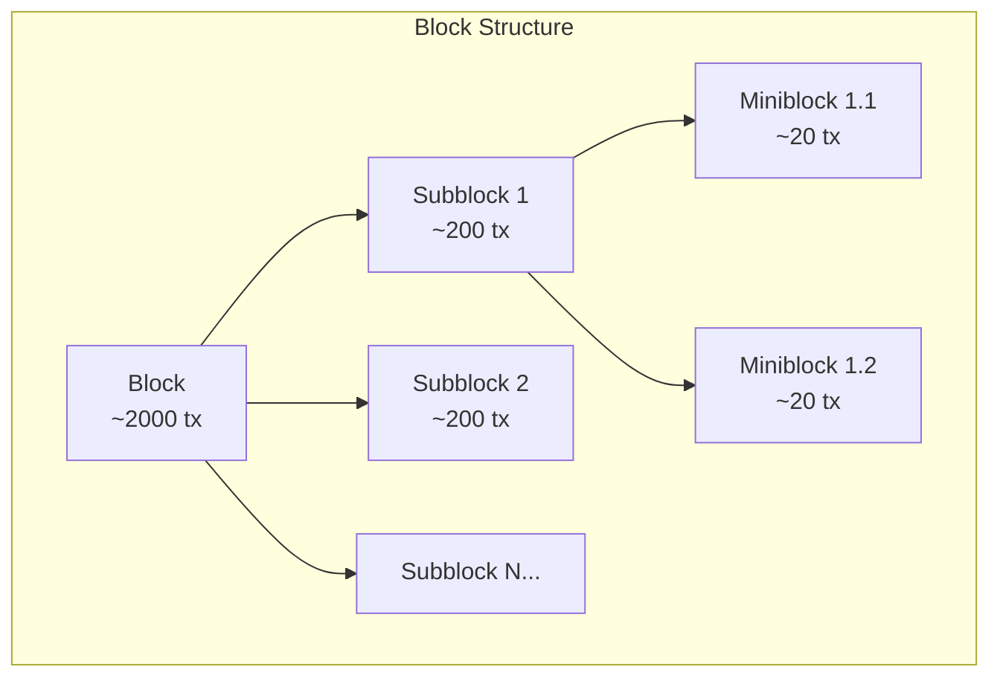
```mermaid
graph TD
    subgraph "Block Structure"
        B[Block<br/>~2000 tx]
        SB1[Subblock 1<br/>~200 tx]
        SB2[Subblock 2<br/>~200 tx]
        SBN[Subblock N...]
        MB1[Miniblock 1.1<br/>~20 tx]
        MB2[Miniblock 1.2<br/>~20 tx]
    end

    B --> SB1
    B --> SB2
    B --> SBN
    SB1 --> MB1
    SB1 --> MB2
```

### Fee Distribution

| Pool       | Allocation | Purpose                  |
| ---------- | ---------- | ------------------------ |
| Validators | 40%        | Block production rewards |
| Relays     | 30%        | Privacy infrastructure   |
| Treasury   | 20%        | Development fund         |
| Insurance  | 5%         | Slashing protection      |
| Burn       | 5%         | Deflationary pressure    |

### Solana Bridge Integration

```rust
// Bridge uses BLS12-381 for multi-sig
let bridge = SolanaBridge::new(config)?;

// Deposit DCHAT → Wrapped DCHAT on Solana
let transfer = bridge.initiate_deposit(amount, sol_address).await?;

// 2/3 validator threshold for finality
let status = bridge.wait_for_finality(transfer.id).await?;
```

---

## Privacy & Metadata Resistance

### Privacy Layers

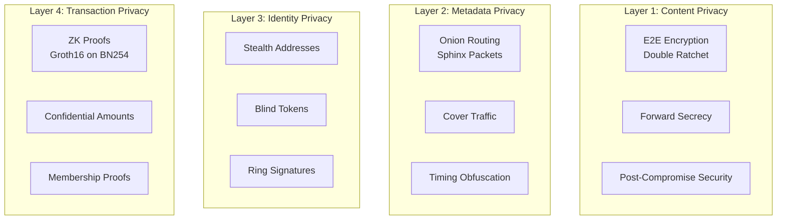
```mermaid
graph TB
    subgraph "Layer 1: Content Privacy"
        CP1[E2E Encryption<br/>Double Ratchet]
        CP2[Forward Secrecy]
        CP3[Post-Compromise Security]
    end

    subgraph "Layer 2: Metadata Privacy"
        MP1[Onion Routing<br/>Sphinx Packets]
        MP2[Cover Traffic]
        MP3[Timing Obfuscation]
    end

    subgraph "Layer 3: Identity Privacy"
        IP1[Stealth Addresses]
        IP2[Blind Tokens]
        IP3[Ring Signatures]
    end

    subgraph "Layer 4: Transaction Privacy"
        TP1[ZK Proofs<br/>Groth16 on BN254]
        TP2[Confidential Amounts]
        TP3[Membership Proofs]
    end
```

### Zero-Knowledge Proofs

Using arkworks with Groth16 on BN254:

```rust
// Groth16 proving system
use ark_groth16::Groth16;
use ark_bn254::Bn254;

// Trusted setup ceremony (MPC)
let params = generate_ceremony(circuit)?;

// Proof generation (prover)
let proof = Groth16::<Bn254>::prove(&pk, circuit, &mut rng)?;

// Verification (verifier)
let valid = Groth16::<Bn254>::verify(&vk, &public_inputs, &proof)?;
```

### Blind Token Protocol

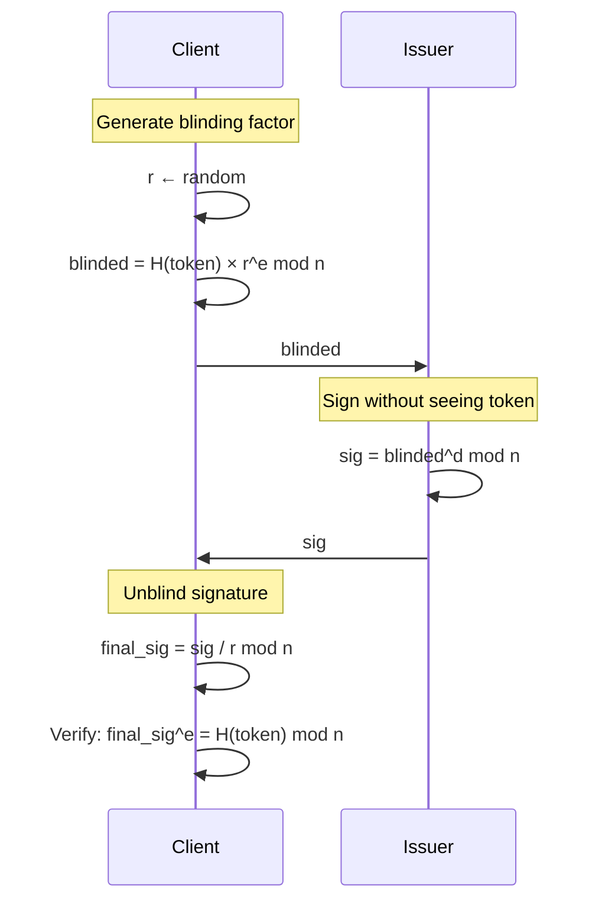
```mermaid
sequenceDiagram
    participant C as Client
    participant I as Issuer

    Note over C: Generate blinding factor
    C->>C: r ← random
    C->>C: blinded = H(token) × r^e mod n

    C->>I: blinded
    Note over I: Sign without seeing token
    I->>I: sig = blinded^d mod n
    I->>C: sig

    Note over C: Unblind signature
    C->>C: final_sig = sig / r mod n
    C->>C: Verify: final_sig^e = H(token) mod n
```

---

## Smart Contract Platform

### WASM Runtime (wasmi 0.40)

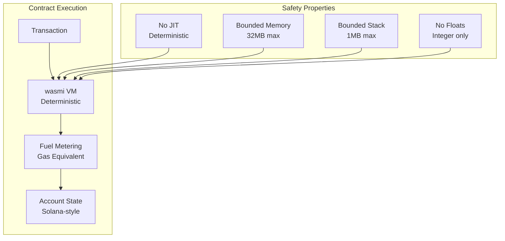
```mermaid
graph TB
    subgraph "Contract Execution"
        TX[Transaction]
        VM[wasmi VM<br/>Deterministic]
        FUEL[Fuel Metering<br/>Gas Equivalent]
        STATE[Account State<br/>Solana-style]
    end

    subgraph "Safety Properties"
        S1[No JIT<br/>Deterministic]
        S2[Bounded Memory<br/>32MB max]
        S3[Bounded Stack<br/>1MB max]
        S4[No Floats<br/>Integer only]
    end

    TX --> VM
    VM --> FUEL
    FUEL --> STATE

    S1 --> VM
    S2 --> VM
    S3 --> VM
    S4 --> VM
```

### DPL (DChat Program Language)

```rust
use dchat_dpl::prelude::*;

#[program]
pub mod counter {
    #[state]
    pub struct Counter {
        pub count: u64,
    }

    #[instruction]
    pub fn increment(ctx: Context) -> Result<()> {
        ctx.accounts.counter.count += 1;
        Ok(())
    }
}
```

### Confidential Tokens

Using Bulletproofs for range proofs:

```rust
// Pedersen commitment: C = v*G + r*H
let commitment = pedersen_commit(amount, blinding_factor);

// Range proof: 0 ≤ amount < 2^64
let range_proof = bulletproofs::prove(amount, blinding_factor)?;
```

---

## Validator Key Management

### AWS KMS Integration

**CRITICAL INTERNAL DOCUMENTATION**

Validator signing keys are protected using AWS KMS envelope encryption:

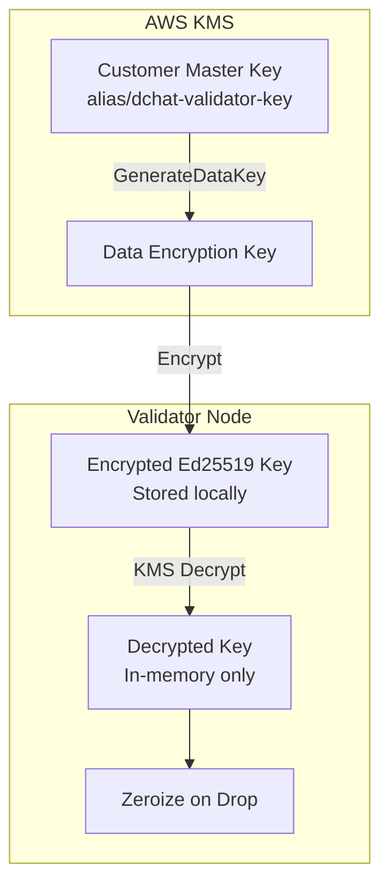
```mermaid
graph TB
    subgraph "AWS KMS"
        CMK[Customer Master Key<br/>alias/dchat-validator-key]
        DEK[Data Encryption Key]
    end

    subgraph "Validator Node"
        ENC[Encrypted Ed25519 Key<br/>Stored locally]
        MEM[Decrypted Key<br/>In-memory only]
        ZERO[Zeroize on Drop]
    end

    CMK -->|GenerateDataKey| DEK
    DEK -->|Encrypt| ENC
    ENC -->|KMS Decrypt| MEM
    MEM --> ZERO
```

#### Key Hierarchy

```text
AWS KMS CMK (alias/dchat-validator-key)
└── Envelope Encryption
    └── Ed25519 Validator Signing Key
        └── Per-region keys:
            ├── alias/dchat-validator-india
            ├── alias/dchat-validator-uae
            └── alias/dchat-validator-southafrica
```

#### HSM Integration Paths

| Environment    | HSM Type     | Key Path                         |
| -------------- | ------------ | -------------------------------- |
| AWS Production | CloudHSM     | `alias/dchat-validator-{region}` |
| AWS Dev/Test   | KMS Standard | `alias/dchat-test-key`           |
| On-Prem        | Thales Luna  | `/opt/dchat/hsm/validator.key`   |
| Air-Gapped     | YubiHSM 2    | `slot:0x0001`                    |

#### KMS Operations

```rust
use dchat_crypto::kms::{AwsKmsClient, Ed25519KmsWrapper, KmsKeyType};

// Initialize KMS client
let kms = AwsKmsClient::new("us-east-1").await?;

// Verify key exists at startup (fail-fast)
kms.verify_key_exists("alias/dchat-validator-key").await?;

// Generate new validator keypair with KMS protection
let (wrapper, encrypted_key) = Ed25519KmsWrapper::generate(
    kms,
    "alias/dchat-validator-key"
).await?;

// Sign block proposal (key decrypted only in memory)
let signature = wrapper.sign(block_hash.as_bytes()).await?;
// Private key automatically zeroized after signing
```

#### IAM Policy Requirements

```json
{
  "Version": "2012-10-17",
  "Statement": [
    {
      "Effect": "Allow",
      "Action": [
        "kms:Sign",
        "kms:Verify",
        "kms:GetPublicKey",
        "kms:Encrypt",
        "kms:Decrypt",
        "kms:DescribeKey"
      ],
      "Resource": "arn:aws:kms:*:*:key/alias/dchat-validator-*",
      "Condition": {
        "StringEquals": {
          "aws:RequestTag/Environment": ["production", "staging"]
        }
      }
    }
  ]
}
```

#### Security Properties

- **No plaintext storage**: Private keys never written to disk unencrypted
- **Audit trail**: All KMS operations logged to CloudTrail
- **Memory safety**: `zeroize` crate ensures keys erased from memory
- **Timeout protection**: 30-second timeout on all KMS operations
- **IAM boundary**: Keys bound to specific validator instances

---

## Deployment Architecture

### Multi-Region Validator Setup

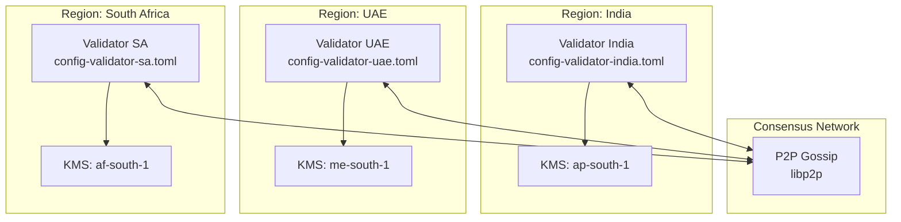
```mermaid
graph TB
    subgraph "Region: India"
        VI[Validator India<br/>config-validator-india.toml]
        KI[KMS: ap-south-1]
    end

    subgraph "Region: UAE"
        VU[Validator UAE<br/>config-validator-uae.toml]
        KU[KMS: me-south-1]
    end

    subgraph "Region: South Africa"
        VS[Validator SA<br/>config-validator-sa.toml]
        KS[KMS: af-south-1]
    end

    subgraph "Consensus Network"
        CN[P2P Gossip<br/>libp2p]
    end

    VI <--> CN
    VU <--> CN
    VS <--> CN

    VI --> KI
    VU --> KU
    VS --> KS
```

### Container Architecture

```yaml
# docker-compose-production.yml structure
services:
  dchat-validator:
    image: dchat/validator:latest
    deploy:
      resources:
        limits:
          cpus: "4"
          memory: 8G
    environment:
      - AWS_REGION=${AWS_REGION}
      - KMS_KEY_ALIAS=alias/dchat-validator-${REGION}
      - RUST_LOG=info,dchat=debug
```

### Kubernetes Deployment

```text
helm/
├── dchat-validator/
│   ├── templates/
│   │   ├── deployment.yaml
│   │   ├── service.yaml
│   │   ├── configmap.yaml
│   │   └── secrets.yaml
│   └── values.yaml
└── dchat-relay/
    └── ...
```

### Observability Stack

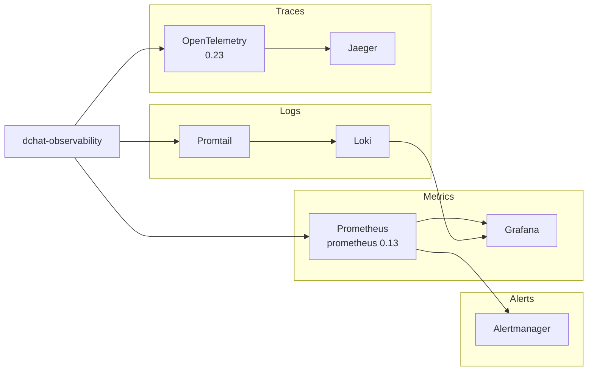
```mermaid
graph LR
    subgraph "Metrics"
        PROM[Prometheus<br/>prometheus 0.13]
        GRAF[Grafana]
    end

    subgraph "Logs"
        PROM_T[Promtail]
        LOKI[Loki]
    end

    subgraph "Traces"
        OTEL[OpenTelemetry<br/>0.23]
        JAEGER[Jaeger]
    end

    subgraph "Alerts"
        AM[Alertmanager]
    end

    APP[dchat-observability] --> PROM
    APP --> PROM_T
    APP --> OTEL
    PROM --> GRAF
    PROM --> AM
    PROM_T --> LOKI
    LOKI --> GRAF
    OTEL --> JAEGER
```

---

## Identity System

### DID Architecture

DChat uses a sovereign decentralized identity system with multi-device support:

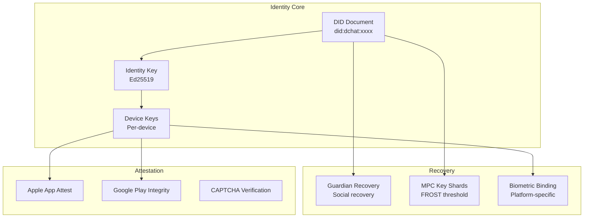
```mermaid
graph TB
    subgraph "Identity Core"
        DID[DID Document<br/>did:dchat:xxxx]
        IK[Identity Key<br/>Ed25519]
        DK[Device Keys<br/>Per-device]
    end

    subgraph "Recovery"
        GUARD[Guardian Recovery<br/>Social recovery]
        MPC[MPC Key Shards<br/>FROST threshold]
        BIO[Biometric Binding<br/>Platform-specific]
    end

    subgraph "Attestation"
        ATT_A[Apple App Attest]
        ATT_G[Google Play Integrity]
        CAPTCHA[CAPTCHA Verification]
    end

    DID --> IK
    IK --> DK
    DID --> GUARD
    DID --> MPC
    DK --> BIO
    DK --> ATT_A
    DK --> ATT_G
```

### FROST Threshold Signatures

Used for distributed identity recovery (2-of-3 or 3-of-5):

```rust
use frost_ed25519::{
    keys::{KeyPackage, PublicKeyPackage},
    round1, round2, Signature,
};

// Key generation ceremony (t-of-n threshold)
let (shares, public_key_package) = frost_ed25519::keys::generate_with_dealer(
    max_signers,    // n = total participants
    min_signers,    // t = threshold
    &mut rng,
)?;

// Signing rounds (distributed)
let signing_commitments = round1::commit(&key_package, &mut rng);
let signature_share = round2::sign(&signing_package, &key_package)?;
```

### Device Attestation Flow

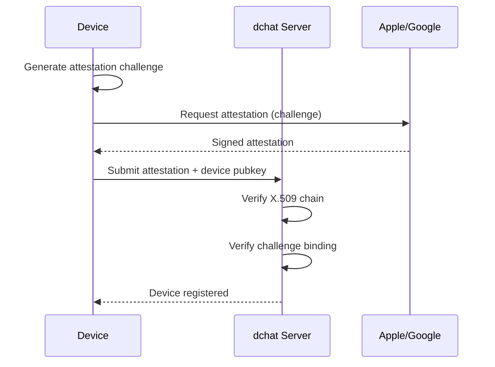
```mermaid
sequenceDiagram
    participant D as Device
    participant S as dchat Server
    participant A as Apple/Google

    D->>D: Generate attestation challenge
    D->>A: Request attestation (challenge)
    A-->>D: Signed attestation
    D->>S: Submit attestation + device pubkey
    S->>S: Verify X.509 chain
    S->>S: Verify challenge binding
    S-->>D: Device registered
```

---

## Governance System

### Protocol DAO Structure

```mermaid
graph TB
    subgraph "Proposal Types"
        P1[Parameter Change]
        P2[Protocol Upgrade]
        P3[Treasury Spend]
        P4[Emergency Action]
    end

    subgraph "Voting Power"
        VP1[Token Weight]
        VP2[TSC Multiplier<br/>Lockup tier]
        VP3[Validator Bonus<br/>+10%]
    end

    subgraph "Execution"
        E1[Timelock<br/>48h standard]
        E2[Emergency Bypass<br/>Multisig only]
    end

    P1 --> VP1
    P2 --> VP1
    P3 --> VP1
    VP1 --> VP2
    VP2 --> VP3
    VP3 --> E1
    P4 --> E2
```

### Moderation System

```mermaid
graph LR
    subgraph "Abuse Reporting"
        AR[User Report]
        AI[AI Pre-filter]
        HM[Human Moderator]
    end

    subgraph "Actions"
        A1[Content Hide]
        A2[Account Suspend]
        A3[Appeal Process]
    end

    AR --> AI
    AI -->|Score > 0.8| HM
    AI -->|Score < 0.3| A3
    HM --> A1
    HM --> A2
    A2 --> A3
```

---

## Bot & Mini-App Platform

### Bot SDK Architecture

```mermaid
graph TB
    subgraph "Bot Runtime"
        BOT[Bot Process]
        WH[Webhook Handler<br/>axum 0.7]
        DB[(SQLite<br/>sqlx 0.8)]
    end

    subgraph "Message Flow"
        IN[Incoming Message]
        ENC[Noise NK Decrypt]
        PROC[Command Handler]
        OUT[Outgoing Message]
    end

    subgraph "Capabilities"
        C1[Read Messages]
        C2[Send Messages]
        C3[Wallet Access]
        C4[Storage Access]
    end

    IN --> ENC
    ENC --> BOT
    BOT --> PROC
    PROC --> DB
    PROC --> OUT
    BOT --> C1
    BOT --> C2
    BOT --> C3
    BOT --> C4
```

### Mini-App Sandbox

Telegram-style mini-apps with permission-based access:

| Permission      | Description       | User Consent    |
| --------------- | ----------------- | --------------- |
| `identity.read` | Read user DID     | Implicit        |
| `wallet.read`   | View balance      | Explicit        |
| `wallet.sign`   | Sign transactions | Per-transaction |
| `storage.read`  | Read app data     | Implicit        |
| `storage.write` | Write app data    | Implicit        |

```rust
// Mini-app manifest
{
    "app_id": "game.example.dchat",
    "version": "1.0.0",
    "permissions": ["identity.read", "wallet.read"],
    "entry_url": "https://example.com/miniapp",
    "signature": "ed25519:xxxx"
}
```

---

## Genesis Configuration

### Token Distribution

```mermaid
pie title Initial Token Distribution (1B DCHAT)
    "Community Allocation" : 560
    "Validator Allocation" : 240
    "Foundation Allocation" : 200
```

### Genesis Pools

| Pool            | Amount | Purpose                   |
| --------------- | ------ | ------------------------- |
| Staking Pool    | 240M   | Validator staking rewards |
| Rewards Pool    | 224M   | Relay & user incentives   |
| Liquidity Pool  | 168M   | DEX & bridge liquidity    |
| Foundation Pool | 200M   | Development & operations  |

### Genesis Validators

Initial validator set (3 nodes for testnet):

- **Stake requirement**: 10M DCHAT per validator
- **Voting power**: Equal (1 each)
- **Key format**: Ed25519 (64-char hex public key)

---

## Appendix: Feature Flags

| Feature                          | Crate            | Purpose                          |
| -------------------------------- | ---------------- | -------------------------------- |
| `hardened-consensus`             | dchat-blockchain | Enable PoRW/PoT/TSC wrappers     |
| `hardened-consensus-integration` | dchat-blockchain | Full coordinator                 |
| `bls-aggregation`                | dchat-blockchain | BLS12-381 signatures             |
| `pq-crypto`                      | dchat-crypto     | Post-quantum primitives          |
| `test-mocks`                     | multiple         | Mock RPC clients (NEVER in prod) |
| `storage-integration`            | dchat-chain      | Database backend                 |
| `captcha`                        | dchat-identity   | CAPTCHA verification             |
| `attestation-api`                | dchat-identity   | Play/App Attest APIs             |

---

## Appendix: Critical Constants

```rust
// Protocol
pub const PROTOCOL_VERSION: &str = "0.1.0";
pub const MAX_MESSAGE_SIZE: usize = 1_048_576;  // 1 MB

// Monetary
pub const MOTES_PER_DCHAT: u64 = 1_000_000_000;  // 10^9
pub const DCHAT_DECIMALS: u8 = 9;

// Consensus
pub const MAX_ACTIVE_VALIDATORS: usize = 1000;
pub const MIN_VALIDATOR_STAKE: u64 = 100_000 * MOTES_PER_DCHAT;
pub const MAX_VALIDATOR_STAKE: u64 = 10_000_000 * MOTES_PER_DCHAT;
pub const UNSTAKE_COOLDOWN_SECONDS: u64 = 7 * 24 * 3600;  // 7 days

// Privacy
pub const DEFAULT_CIRCUIT_HOPS: usize = 3;
pub const CIRCUIT_ROTATION_SECONDS: u64 = 600;  // 10 min
```

---

## Appendix: Error Handling

All crates use structured error types via `thiserror`:

```rust
#[derive(Debug, thiserror::Error)]
pub enum Error {
    #[error("Cryptographic error: {0}")]
    Crypto(String),

    #[error("Network error: {0}")]
    Network(#[from] NetworkError),

    #[error("Storage error: {0}")]
    Storage(#[from] StorageError),

    #[error("Consensus error: {0}")]
    Consensus(#[from] ConsensusError),
}

pub type Result<T> = std::result::Result<T, Error>;
```

---

## Appendix: Testing Strategy

| Test Type         | Location     | Purpose                |
| ----------------- | ------------ | ---------------------- |
| Unit Tests        | `src/*.rs`   | Per-module logic       |
| Integration Tests | `tests/*.rs` | Cross-crate behavior   |
| Property Tests    | `proptest`   | Invariant verification |
| Fuzz Tests        | `fuzz/`      | Security edge cases    |
| Benchmarks        | `benches/`   | Performance regression |

### Benchmark Suite

```text
benches/
├── message_throughput.rs      # E2E message latency
├── crypto_performance.rs      # Crypto primitives
├── post_quantum_crypto.rs     # PQ algorithm overhead
├── storage_backends.rs        # DB performance
├── staking_performance.rs     # Consensus operations
├── cross_chain_bridge.rs      # Bridge latency
├── onion_routing_performance.rs  # Privacy overhead
└── concurrent_clients.rs      # Scalability tests
```

---

## Appendix: Security Considerations

### Threat Model

| Threat            | Mitigation                                |
| ----------------- | ----------------------------------------- |
| Quantum adversary | Hybrid PQ crypto (ML-KEM + X25519)        |
| Network observer  | Onion routing, cover traffic              |
| Compromised relay | Multi-hop circuits, no single point       |
| Key compromise    | Forward secrecy, post-compromise security |
| Sybil attack      | Stake requirement, VRF selection          |
| Eclipse attack    | ASN/geographic diversity requirements     |
| Timing analysis   | Constant-time crypto, timing obfuscation  |

### Audit Status

| Component        | Auditor         | Date    | Status         |
| ---------------- | --------------- | ------- | -------------- |
| FROST-Ed25519    | NCC Group       | 2023    | ✅ Passed      |
| Signal Protocol  | Academic review | Ongoing | ✅ Established |
| wasmi Runtime    | Parity          | 2024    | ✅ Production  |
| Custom consensus | Pending         | TBD     | 🔄 Planned     |
